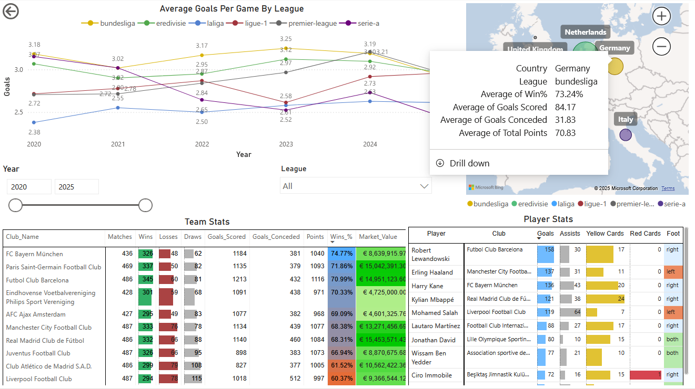

# Power BI: Data visualisation

We create a Power BI Report called ["Dashboard: The-football-pundits"](https://app.powerbi.com/groups/me/dashboards/db2f08f1-c37f-4bd4-bc99-2890e7688bce?ctid=56c1d497-700b-49cf-8f8d-3dd6b20d522f&experience=power-bi):

The dashboard consists of 6 visualisation charts:

Data is collected from 2020-2025 mid year for respective 6 leagues - Bundesliga, Eredivisie, Laliga, Ligue-1, Premier-League, Serie-a that is tier first class league in Germany, Netherlands, Spain, Italy and England(UK)

1. Chart 1: League Performance Over Time
Displays the average goals per game for each league, broken down year by year, to analyze scoring trends over time.

2. Chart 2: Country-wise League Summary
Compares leagues within each country, showing their average goals per match, win percentage, and total match points, to provide a multi-metric performance overview that can be drill down to clubs.

3. Chart 3: Top Clubs by League - Team Stats
Highlights the top 10 clubs from each league based on matches played, market value, and win percentage, offering insight into the most dominant and valuable teams.

4. Chart 4: Top Players by Club - Player Stats
Displays the top 10 players from each club, focusing on goal contributions (goals + assists) and disciplinary records (yellow/red cards), allowing for performance and behavior comparison.

5. Chart 5: Year Slicer (2020–2025)
An interactive year slicer that allows users to filter data across all charts based on a selected year within the 2020–2025 range.

6. Chart 6: League Slicer(Bundesliga, Eredivisie, Laliga, Ligue-1, Premier-League, Serie-a)
A league filter that lets users dynamically update all visualizations based on the selected league, for focused analysis.

