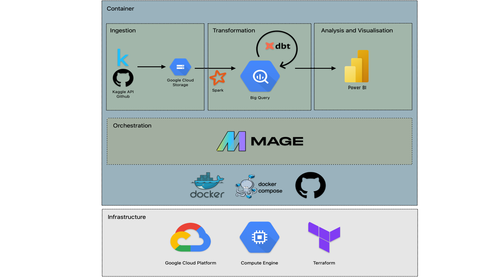

# The Football Pundits: Decoding the beautiful game ⚽️

## Table of Contents
- [Introduction](#introduction)
    - [Background and Motivation](#background-and-motivation)
    - [Data sources](#data-sources)
    - [Objectives](#objectives)
- [Data Pipeline](#data-pipeline)
    - [Tools/ Resources Used](#tools-resources-used)
    - [Methodology/Reproducibility](#methodologyreproducibility)
    - [Visualisation/Dashboard](#visualisationdashboard)
- [Follow-up Work](#follow-up-work)
- [Contributors](#contributors)
- [License](#license)
- [Acknowledgments](#acknowledgments)
- [Contributions and Feedback](#contributions-and-feedback)

# [INTRODUCTION](#introduction)

## [Background and Motivation](#background-and-motivation)

In the realm of professional football, the quest for competitive advantage hinges on precise insights derived from data. Recognizing this, the project undertakes the task of systematically tracking and analyzing player contributions across major European leagues. The motivation behind this endeavor lies in the necessity to discern patterns, trends, and outliers in player performance metrics, thereby enabling clubs to optimize recruitment strategies, tactical approaches, and player development pathways. Additionally, assessing league-level metrics offers a broader context for evaluating the relative strengths and weaknesses of different footballing competitions. This contributes to a more nuanced understanding of the sport's landscape.

> This project aims to provide a comprehensive analysis of teams and player performance within the top 6 first class division football leagues in the world from 2020 to 2025, coupled with an assessment of teams performance metrics. Leveraging key performance indicators (KPIs) such as goals, assists, and disciplinary records, the dashboard offers a data-driven approach to understanding the dynamics of football at both individual and league-wide levels. By synthesizing diverse data points, this initiative facilitates informed decision-making for stakeholders ranging from club managers, team scouts to sports analysts.

## [Data sources](#data-sources)

The raw data for our project is football data scraped from the [Transfermarkt](https://en.wikipedia.org/wiki/Transfermarkt) website. The dataset is composed of multiple CSV files with information on competitions, games, clubs, players, player valuations and appearances that is automatically updated once a week. Each file contains the attributes of the entity and the IDs that can be used to join them together. The dataset is available on [Kaggle](https://www.kaggle.com/datasets/davidcariboo/player-scores) and this is where we download the data from using the **Kaggle API** to our github repository folder `data/`. For details about the dataset, check out [our instructions](./data/README.md) or the [Kaggle dataset page](https://www.kaggle.com/datasets/davidcariboo/player-scores). 

## [Objectives](#objectives)

The key objectives for our project are:
1. Extract the raw Transfermarkt football datasets, transform it to a structured format and store it in a data lake

2. Process the relevant datasets, merge them into a single source of truth and export it as an external table to a data warehouse, leveraging orchestrators and distributed computing for the heavy-lifting

3. Transform the external table into meaningful materialised tables/views in the warehouse that helps us track key metrics and performance indicators

4. Visualise these KPIs and analyse the player/teams/league performances on a dashboard

# [DATA PIPELINE](#data-pipeline)

⚠️ This Google Project is created on GCP trial account that will get expire on 23 July 2025 ⚠️

For achieving the objectives listed above, we build an end-to-end data pipeline, starting from the raw Transfermarkt data on Kaggle, and ending with a Power BI dashboard that seeks to shed some insights.

## [Tools/ Resources Used](#tools-resources-used)

1. Terraform
2. GCP Compute Engine virtual machine
3. GCP Cloud Storage
4. GCP BigQuery
5. GCP Dataproc
6. Power BI
7. Docker/docker-compose
9. Mage
10. DBT cloud
11. Spark/pySpark
12. git/git lfs
13. Kaggle API

## [Methodology/Reproducibility](#methodologyreproducibility)

*Reproducibility of this project can be ensured by following the instructions for each step.*

1. **Download Data:** Download raw Transfermarkt football data related to appearances and competitions, from Kaggle using the API [[Instructions]](./data/README.md)

2. **Setup Environment:** Create Google cloud project, service accounts, SSH access, compute engine VM and the VM environment to run the rest of the pipeline [[Instructions]](./gcp-cloud-infrastructure/README.md)

3. **Infrasturcture as Code:** Use Terraform to create GCP resources (GCS bucket, BQ dataset, Dataproc cluster) [[Instructions]](./terraform-iac/README.md)

4. **Containerised orchestration of raw data:** Using Mage as an orchestrator, build an ETL pipeline that loads the raw data, structures it and exports to the GCS bucket. [[Instructions]](./mage-orchestrator/README.md)

5. **Distributed computing on processed data:** Transform the two processed datasets in the bucket into a single dataset, using pyspark and GCP Dataproc cluster, and export it as an external table in BigQuery [[Instructions]](./spark-distributed-computing/README.md)

6. **Transformation inside data warehouse:** Build, stage and deploy a transformation production using dbt, that takes the external table from BigQuery and creates materialised tables which just consists of data corresponding to the top-five European leagues [[Instructions]](./dbt-data-transformation/README.md)

7. **Partition and cluster data inside warehouse:** based on the date and player_id respectively, thus creating partitioned and clustered materialised tables

8. **Build dashboard:** Visualise player and league performance using Power BI, for some KPIs related to goal contributions and disciplinary records

## [Visualisation/Dashboard](#visualisationdashboard)
Link to Power BI workspace - https://app.powerbi.com/links/pOuedtK5r7?ctid=56c1d497-700b-49cf-8f8d-3dd6b20d522f&pbi_source=linkShare

The dashboard consists of 6 visualisation charts:

Data is collected from 2020-2025 mid year for respective 6 leagues - Bundesliga, Eredivisie, Laliga, Ligue-1, Premier-League, Serie-a that is tier first class league in Germany, Netherlands, Spain, Italy and England(UK)

1. chart #1: League Statistics: Average goals per game by league in each year.
2. chart #2: League Statistics: Per country per league average of goals, win percentage and total Matchpoints
3. chart #3: Teams Statistics: Top 10 clubs from each league matches played, market value and winning percentage.
4. chart #4: Player Statistics: Top 10 players from each club wth goal contributions (goals/assists), disciplinary records (yellow/red cards)
5. chart #5: Year Slicer: To adjust between the 2020-2025 with relation with other charts
6. chart #6: League Slicer: To filter by League name with relation with other charts

# [Follow-up Work](#follow-up-work)

* Add tests
* Use make
* Add CI/CD pipeline
* Build automated pipeline

# [Contributors](#contributors)
Aditya Gurung, aditya.grng@gmail.com

# [License](#license)
This project is licensed under the [MIT License](./LICENSE).

# [Acknowledgments](#acknowledgments)
* [Alexey Grigorev](https://github.com/alexeygrigorev)
* [DataTalks.Club](https://datatalks.club/)
* [transfermarkt-datasets](https://github.com/dcaribou/transfermarkt-datasets)