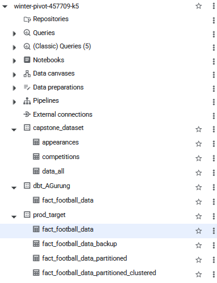

# BigQuery: Data warehouse

*We use BigQuery as our data warehouse, and produce materialised tables paritioned by date and clustered by player_id, from the external data `prod_target.fact_football_data` outputed by dbt data transformations.*

Pre-requisites: [Production processed materialised table `e2e-data-pipeline-capstone.prod.fact_football_data` -- output of data transformation tool dbt](../dbt-data-transformation/README.md)

## Queries

We use the SQL queries in this folder to create three tables:
* `data_all`: to merge competitions and appearances schema into one table
* `fact_football_data_partitioned`: partitioned on date
* `fact_football_data_partitioned_clustered`: partitioned on data and clustered by player_id

### Query to merge two different table into one table using common attribute

```sql
CREATE OR REPLACE TABLE `winter-pivot-457709-k5.capstone_dataset.data_all` AS
SELECT
  *
FROM `winter-pivot-457709-k5.capstone_dataset.appearances`
LEFT JOIN `winter-pivot-457709-k5.capstone_dataset.competitions`
USING (competition_id);
```

### Partitioning

```sql
-- Creating a paritioned table
CREATE OR REPLACE TABLE `winter-pivot-457709-k5.prod_target.fact_football_data_partitioned`
PARTITION BY DATE(date) AS
SELECT * FROM `winter-pivot-457709-k5.prod_target.fact_football_data`;
```

### Partitioning and clustering

```sql
-- Creating a paritioned and clustered table
CREATE OR REPLACE TABLE `winter-pivot-457709-k5.prod_target.fact_football_data_partitioned_clustered`
PARTITION BY DATE(date)
CLUSTER BY player_id AS
SELECT * FROM `winter-pivot-457709-k5.prod_target.fact_football_data`;
```

## BigQuery Tables

**Final list of external/materialised tables created on BigQuery**

